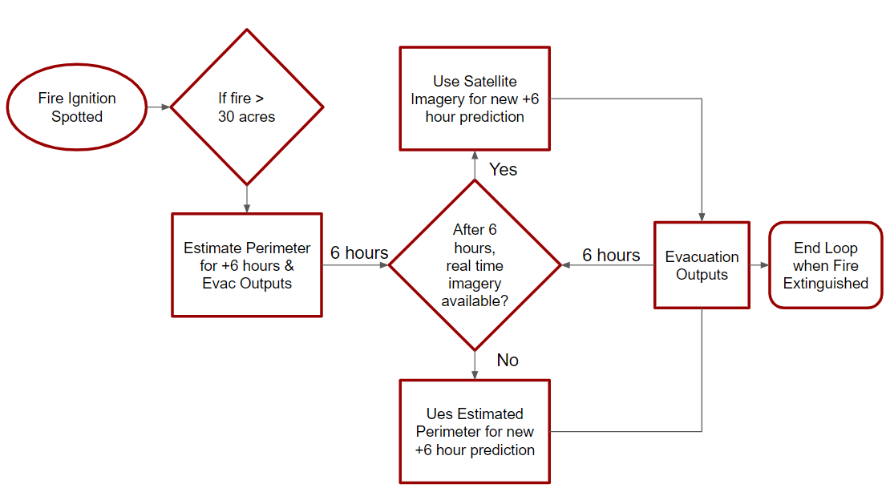

## Wildfire Hackathon
Project by: Jack Seagrist, Yash Gaur, Hunter Johnson
 
## Problem Statement

Wildfires pose a significant risk to human life and infrastrucutre and have a massive associated economic costs: Insurance claims alone topped $12 billion in 2018 for California (1 & 2).  Semi-arid regions, like California, naturally face wildfires seasonally but because climate and weather directly influence wildfire risks, but global warming is expected to further exacerbate fire damage towards natural and urban ecosystems (3).  During 2015-2020, several unprecedented fires have occured in varying regions and ecosystems of California, stretching exsisting support thin and highlighting the need for new ideas and tools. 

### Motivation

One vital aspect of fire loss prevention is evacuation procedures, in particular how fire and police authorities decide and implement effective yet necessary evacuations in the face of imminent danger.  Aggressive fires, jammed roads, and panicked evacuees can complicate well thought out evacuation procedures potentially having fatal results.

Even when a town has preprepared evacuation zone, such as in Paradise, dissemination of information and response in a time sensitive situation can still be extremely difficult (4). Officials attempted to alert the public through the national Integrated Public Alert and Warning System (IPAWS) during the Camp fire but encountered technical difficulties, highlighting the need for improved communication solutions during disaster events (5).

In addition, many mid size and small fire departments still rely on experience and non digital tools for evacuation. With the increasing availability of open source data and techonology, there is a real potential to create tools that can make the first responders' decision making process easier during disasters.

Our project aims to create an easy to use, government facing, data based tool that assists fire departments in real time evacuation scenarios.  Our tool utilizes live traffic and critical facilities data to provide a blend of need to know data to decision makers in high stake situations.  High human and economic loss fires such as the Camp Fire in Paradise, CA serve as a motivation to help provide information for safe evacuation routes or areas to shelter to minimize wildfire loss. 

### Challenges

Creating a data based live platform has several challenges, most surrounding availability of useful data and its timely implementation.  However, clever integration of online softwares allows a variety of critical variables to be available simultaneously while constantly updating.  Data and technological approaches that fight natural disasters are still nascent but are rapidly evolving, providing a promising future for our platform.  In addition to technological challenges there are social and financial barriers. Evacuations must strike a balance such that unnesecary evacuations don't fatigue people and deter their faith in evacuation orders.  Also, many fire agencies have tight budgets and may not be able to afford useful model predictions or live aerial information that larger agencies may be able to use.  Our platform strives to address each unique challenge in a manner that allows it to be accessible and beneficial for smaller agencies on the front lines.  

## Project Scope

The scope of our project for this hackathon was to gather stakeholder feedback and create a proof of concept for a potential product. We met with various fire department officials across California as well as industry mentors to identify the critical features that would provide the most benefit in evacuation scenarios. Based on the discussions we've had with stakeholders, there are six key components that we've included in the prototype which are described below.

1. **Basemap**: The base layer on which all of our data is added. All of the information generated from the fire prediction models and subsequent evacuation level estimates will be added on top of this layer. We investigated using both Mapbox and ArcGIS Webmaps and ultimately went with ArcGIS Webmaps for this project for its ease of use and additional data layers available.

2. **Fire Perimeter Prediction**: Our product will provide an estimate for the fire perimeter over a specified duration of time, given the current input conditions. We used FlamMap 6, which incorporates numerous fire behavior models, such as Rothermel's surface spread model, and allows users to generate predicted fire perimeters given land, weather, fuel, and time inputs.

3. **Evacuation Overlay**: Following the California guidelines, our tool will provide estimates for the evacuation level in the areas surrounding the predicted fire perimeter. We understand that enforcing these different orders are up to the discrection of the officials in the city and therefore these layers simply serve as a reference for the decision makers. The California evacuation levels are:

      •Evacuation Order: Immediate threat to life. This is a lawful order to leave now. The area is lawfully closed to public access.
      
      •Evacuation Warning: Potential threat to life and/or property. Those who require additional time to evacuate, and those with pets        and livestock should leave now. 
      
4. **Traffic Information**: Our tool will provide the latest traffic information for the area. Having the current traffic data for an area is crucial for officials to effectively respond to a disaster situation. Knowing the traffic flow out of a city jurisdiction helps with evacuating citizens, but it can also be used to identify key access points for delivering resources to fight the fire.

5. **Key Infrastructure**: Our tool will provide information on critical infrastructure that is prone to higher evacuation time. Through our talks with officials, we've identified hospitals, nursing homes, and schools as the areas that require above average evacuation time.

6. **Addding Defended Space**: Our tool will allow officials to mark defensible space in the event that complete evacuation of all citizens is not feasible.

## Prototype

We have developed a static prototype for the hackathon, which can be found at the following link:

[Prototype](map.html)

We envision users being able to access the tool via a web browser during a fire event. Users will be able to see the predicted perimeters and accompanying evacuation outputs. The data will be updated every six hours during the life of the fire event, described in the workflow below. Users will be able to use the information regarding predicted perimeter, traffic, and key locations to inform their evacuation response as the fire progresses.

## Future Work

The following sections describe the work needed to take this project from a concept to a viable product.

### Model

Our initial approach was to use machine learning techniques to develop a model which could predict the fire spread for a given period of time based on open source satellite imagery. However, after initial development we realized due to the complex nature of fire behavior we did not have access to enough data or data with the temporal and spatial resolution required to make an effective model. We switched our approach and began to search for exisiting models and tools that we could use to implement in our prototype, deciding on FlamMap. Currently we generate outputs from FlamMap using the windows software on our personal computers. If this product were to move forward, we would need to develop a way to host the model on a server such that users could run computations from their web browser.

### Automation

As described above, our current prototype is a static wireframe of the potential tool. To create an operational tool, we would need to develop the infrastructure between the input data, model, and final output layers. This would allow us to take our proof of concept from a static wireframe to a useable web based tool.

### Licensing

Part of the goal of our project is to use as much open source information and software as possible to make the product easily accessible to the deparments with limited resources. Our current prototype is based on the ESRI software platform, which requires licenses. If we were to continue to move forward with development, we would want to investigate what the current level of access to ESRI software is at the medium to small size departments. In addition, we would continue to look at alternative platforms such as Mapbox for developing the tool.

### Dissemination to the Public

Our current focus of the tool has been to help fire and sheriff's departments with their evacuation management. However, as mentioned earlier a key problem also lies with getting information to the public. This is outside the current scope of the tool, but would be a great area to ideate around for future work to provide a more comprehensive solution to evacuation management.

### Redundancy

A key aspect to esnure that our future tool is successful is redundancy for information relay, esnuring all necessary up to date information is effectively available for firefighters.  Many wildfires destroy key infrastructure such as communication towers or occur in remote locations with limited access to communication resources.  Disseminating our tool during emergency situations would require redunant modes of communication to account for these potential problems.  Some possible solutions are having our tool downloaded to mobile phones along with current and future conditions or taking advantage of closed firefighter communication systems such as radio.   

## Data

1. National Interagency Fire Center (NIFC) FTP server(6) - GIS data generated from Incident teams including fire points, fire perimeter, and fire polygons.

2. Environmental Systems Research Institute (ESRI) data layers (7) - ESRI generates data layers which are accessible via their webmaps. Our project included layers for Nursing Homes, Hospitals, School location, and Traffic.

## Tools

1. ArcGIS Web Map - ArcGIS Web Maps was used to prototype the final map output for the fire evacuation management tool. 

2. FlamMap 6 - Desktop application that is used to simulate fire behavior. Includes FARSITE (Finney 1998, 2004) and FlamMap BASIC (Finney 2006), Minimum Travel Time (MTT, Finney 2002, 2006), Treatment Optimization Model (Finney 2001, 2006, 2007), and Conditional Burn Probability (Finney 2005, 2006).

3. QGIS - Open Source Geographic Information System used to process geospatial data.

## References

[1] California Department of Insurance 2019, 'Wildfire Insurance Losses from November 2018 blazes top $12 billion', News 2019 Press Release.

[2] Kousky et al, 2018, 'Wildfire Costs in California: The Role of Electric Utilities', Wharton Risk Management and Decision Process Center.

[3] Thomas et al. 2017, 'The Costs and Losses of Wildfires', National Institute of Standards and Technology.

[4] Paradise Evacuation Zones(https://www.townofparadise.com/index.php/17-news-events/248-evacuation-zones).

[5] Zoe Todd Sydney Trattner Jane McMullen, "Ahead of Camp Fire Anniversary, New Details Emerge of Troubled Evacuation (https://www.pbs.org/wgbh/frontline/article/camp-fire-anniversary-new-details-troubled-evacuation/).

[6] https://www.nifc.gov/

[7] https://www.esri.com/en-us/home

[8] Descartes Labs(https://www.descarteslabs.com/)

## Thank you

We would like to thank the following people for their help in the creation of this project: Derek Fong, Rebecca Miller, Stace Maples, Caitlin Kontgis and the Descartes Labs team, Megan Danielson and the Mapbox team, Scott Westrope, David Shew, Nic Elmquist, and all of the other hackathon teams!
